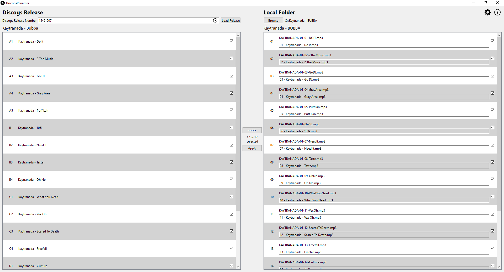

# DiscogsRenamer

A PyQt6-based desktop application that automates renaming audio files in a folder using tracklisting data from a selected Discogs release. 

It retrieves release tracklisting data, allows you to match tracks to files, and applies consistent filename rules through a clean GUI.



## Features

- Enter a Discogs release ID to fetch its tracklisting
- Browse and select your local folder of audio tracks
- The files being renamed can be reordered if needed
- Rename every file in the folder or just a selected subset
- Specify the formatting of the filename and the information included
- Rename files safely with user-controlled substitution for invalid filename characters

## Download & Run

### Windows

1. Download the .exe from the Assets of the [latest release](https://github.com/JimboMonkey/DiscogsRenamer/releases/latest)

2. Double‑click to run

### Linux (AppImage)

1. Download the AppImage from the Assets of the [latest release](https://github.com/JimboMonkey/DiscogsRenamer/releases/latest)

2. Make it executable:

    ```bash
    chmod +x DiscogsRenamer-v1.0.0-x86_64.AppImage
    ```

3. Run it:

    ```bash
    ./DiscogsRenamer-v1.0.0-x86_64.AppImage
    ```

## Developer Setup (Linux)

1. Install system dependencies

```bash
chmod +x scripts/setup-system.sh
./scripts/setup-system.sh
```
This installs Python tooling (pipx, uv) and the system libraries required for running PyQt6 applications and building the project with PyInstaller.

2. Create and activate a virtual environment

```bash
# In a new terminal (to pick up the uv path update)
uv venv
source .venv/bin/activate
```

3. Install project dependencies

```bash
uv sync --extra dev
```

This installs both the runtime and development dependencies defined in pyproject.toml.

## Developer Setup (Windows)

1. Install pipx (Python application manager)

```powershell
# In a PowerShell terminal
.\scripts\setup-system.ps1
```

This installs pipx and updates your PATH.
A new terminal is required for the PATH change to take effect.

2. Install uv

```powershell
# In a new PowerShell terminal (to pick up the PATH update)
pipx install uv
```

3. Create and activate a virtual environment

```powershell
uv venv
.\.venv\Scripts\activate.ps1
```

4. Install project dependencies

```powershell
uv sync --extra dev
```

This installs both the runtime and development dependencies defined in pyproject.toml.

## Running from Source

### From the command line:

```bash
python main.py
```

### From VS Code:

* Use the included launch.json to start the application from main.py

## Building a Standalone Executable

If you want to build a standalone executable for your own system (not an AppImage), use PyInstaller in onefile mode. This applies to both Windows and Linux.

Note that PyInstaller uses different path separators for --add-data depending on the platform:

* Linux / macOS: SRC:DEST
* Windows: SRC;DEST

```bash
uv run pyinstaller --noconfirm --name DiscogsRenamer --windowed --onefile --add-data="discogsrenamer/gui/icons:discogsrenamer/gui/icons" main.py
```

This command produces a single executable in the dist/ directory.

If you want to build an AppImage, use PyInstaller in onedir mode and then package the directory using appimagetool.

## Contributing

See `CONTRIBUTING.md` for guidelines on pull requests and testing requirements.

## License

GPL-3.0. See `LICENSE` for details.


